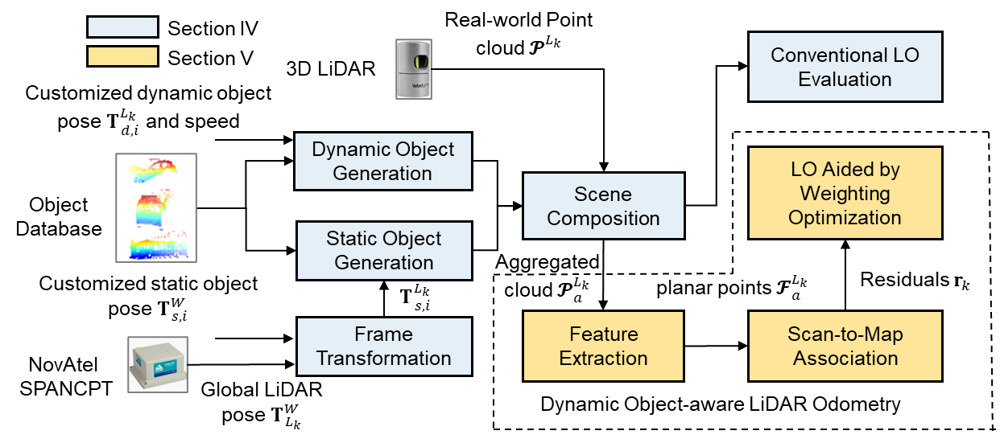
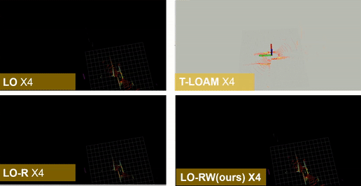
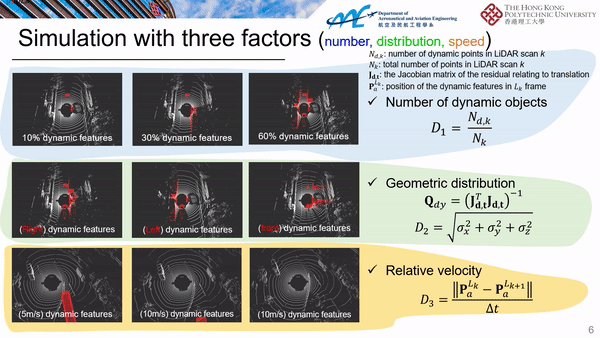

# DynaLO

This repo contains the implementation for our [paper](https://ieeexplore.ieee.org/document/10337805): **Dynamic Object-aware LiDAR Odometry Aided by Joint Weightings Estimation in Urban Areas**. The proposed DynaLO method is released, and the LiDAR vehicle simulator is now also available in the `lidar_vehicle_sim/` directory!

<p align="center">
  
</p>

## Evaluation

<p align="center">
  
</p>

## Prerequisites

We tested on Ubuntu 64-bit 18.04, ROS Melodic. [ROS Installation](http://wiki.ros.org/ROS/Installation). The package is tested on Ubuntu 18.04 with ROS Melodic. 

### 1. **Ceres Solver** 
[Ceres Solver](http://ceres-solver.org/installation.html)


## Build
### Clone repository:
```
    cd ~/catkin_ws/src
    git clone https://github.com/DarrenWong/code_for_dynaLO.git
    cd ..
    catkin_make
    source ~/catkin_ws/devel/setup.bash
```
## Download test rosbag
Download [dynamic vehicle data](https://www.dropbox.com/scl/fi/j1ddn5yx89nsog82qycsc/dynamic_nuscene_0171.bag?rlkey=cn68y9exz9oyw06gbazgr6her&dl=0), this data is modified based on [nuScenes](https://www.nuscenes.org/) Sequence 0171 using our proposed vehicle simulator (see `lidar_vehicle_sim/` for the released simulator).

## LiDAR Vehicle Simulator

The `lidar_vehicle_sim/` directory contains a ROS-based tool that injects synthetic moving vehicles into a static LiDAR point-cloud scene and produces a ground-truth-labelled ROS bag — without any physical sensor.

<p align="center">
  
</p>

Key features:
- Simulates hollow bounding-box vehicle models sampled at 10 pts/m
- Handles occlusion by culling background points inside each vehicle's angular footprint
- Labels points in the `time` field: `10` = dynamic, `5` = static
- Supports two modes: **bag mode** (augments a pre-recorded static scene) and **live mode** (subscribes to `/velodyne_points` in real time)

See [`lidar_vehicle_sim/README.md`](lidar_vehicle_sim/README.md) for full setup instructions and usage details.
If Git LFS is not familiar or convenient, the simulator input bag `non_dynamic.bag` can also be downloaded directly from [Dropbox](https://www.dropbox.com/scl/fi/pwac41k7ub2sx0c9ffh2j/non_dynamic.bag?rlkey=x9cste9xk04n9ukiquxhmkzfs&st=lsc5s8xa&dl=0).


### Launch
```
    roslaunch dynaLO reweight.launch
```


## Acknowledgements
This work is based on [F-LOAM](https://github.com/wh200720041/floam) and [LIO-Mapping](https://github.com/hyye/lio-mapping). Thanks for their great work!


## Citation
If you use this work for your research, you may want to cite

F. Huang, W. Wen, J. Zhang, C. Wang and L. -T. Hsu, "Dynamic Object-aware LiDAR Odometry Aided by Joint Weightings Estimation in Urban Areas," in _IEEE Transactions on Intelligent Vehicles_, doi: 10.1109/TIV.2023.3338141.

```
@article{dynaLO2023huang,
  author={Huang, Feng and Wen, Weisong and Zhang, Jiachen and Wang, Chaoqun and Hsu, Li-Ta},
  journal={IEEE Transactions on Intelligent Vehicles},
  title={Dynamic Object-aware LiDAR Odometry Aided by Joint Weightings Estimation in Urban Areas}, 
  year={2023}
}
