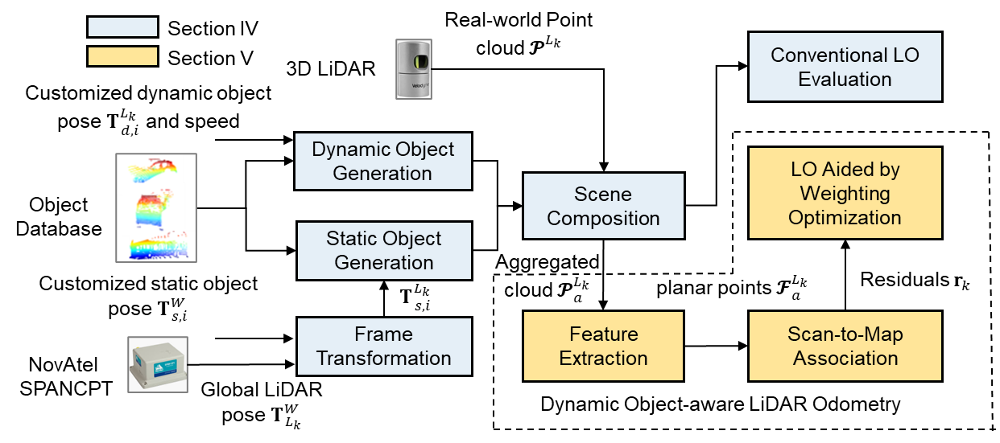

# DynaLO

This repo will contain the implementation for our [paper](https://ieeexplore.ieee.org/document/10337805): **Dynamic Object-aware LiDAR Odometry Aided by Joint Weightings Estimation in Urban Areas**. The proposed method is released, and the vehicle simulator will be released once it is ready!

<p align="center">
  
</p>

## Videos:
Checkout our demo at [Video Link](https://youtu.be/R6M81tOSEi0)
<p align='center'>
<a href="https://youtu.be/R6M81tOSEi0">

</a>
</p>

## Prerequisites

We tested on Ubuntu 64-bit 18.04, ROS Melodic. [ROS Installation](http://wiki.ros.org/ROS/Installation). The package is tested on Ubuntu 18.04 with ROS Melodic. 

### 1. **Ceres Solver** 
[Ceres Solver](http://ceres-solver.org/installation.html)


## Build
### Clone repository:
```
    cd ~/catkin_ws/src
    git clone https://github.com/DarrenWong/code_for_dynaLO.git
    cd ..
    catkin_make
    source ~/catkin_ws/devel/setup.bash
```
## Download test rosbag
Download [dynamic vehicle data](https://www.dropbox.com/scl/fi/j1ddn5yx89nsog82qycsc/dynamic_nuscene_0171.bag?rlkey=cn68y9exz9oyw06gbazgr6her&dl=0), this data is modified based on [nuScenes](https://www.nuscenes.org/) Sequence 0171 using our proposed vehicle simulator (will release soon) 


### Launch
```
    roslaunch dynaLO reweight.launch
```


## Acknowledgements
This work is based on [F-LOAM](https://github.com/wh200720041/floam) and [LIO-Mapping](https://github.com/hyye/lio-mapping). Thanks for their great work!


## Citation
If you use this work for your research, you may want to cite

F. Huang, W. Wen, J. Zhang, C. Wang and L. -T. Hsu, "Dynamic Object-aware LiDAR Odometry Aided by Joint Weightings Estimation in Urban Areas," in _IEEE Transactions on Intelligent Vehicles_, doi: 10.1109/TIV.2023.3338141.

```
@article{dynaLO2023huang,
  author={Huang, Feng and Wen, Weisong and Zhang, Jiachen and Wang, Chaoqun and Hsu, Li-Ta},
  journal={IEEE Transactions on Intelligent Vehicles},
  title={Dynamic Object-aware LiDAR Odometry Aided by Joint Weightings Estimation in Urban Areas}, 
  year={2023}
}
